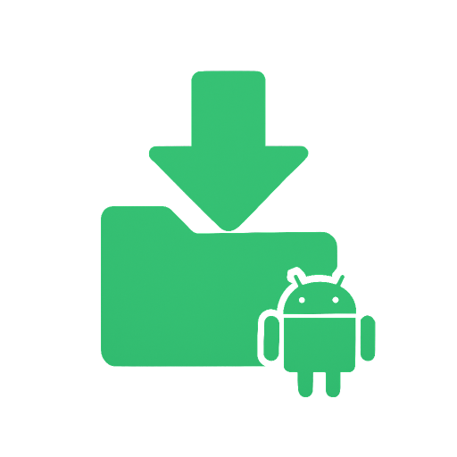

<a href="./README.md"></a>
<a href="./README.ru.md"></a>

<p align="center">
    <picture>
        <source media="(prefers-color-scheme: dark)" srcset="media/logo-dark.png">
        <source media="(prefers-color-scheme: light)" srcset="media/logo.png">
        
    </picture>
</p>

<h3 align="center">Downloader TV+</h3>
<h4 align="center">Android TV tool</h4>

<p align="center">
    <a href="#-quick-start">Quick start</a> · <a href="./RUNNING.md">Documentation</a> · <a href="https://github.com/mopsicus/downloader-tv/issues">Report Bug</a>
</p>

# 💬 Overview

Downloader TV+ is a native Android application designed for TV devices that allows you to download files from the internet and copy data to clipboard. Built with Kotlin and optimized for Android TV remote control navigation.

### Problem

Android TV devices often lack convenient tools for downloading files from the internet and accessing local files. And there is one really serious inconvenience — when you need to copy something to the clipboard on your TV. Most file managers are designed for touch screens and don't work well with TV remotes.

### Solution

This app provides a simple interface optimized for TVs, with support for navigation using the D-pad. It includes two main functions: downloading files by URL, opening and copying file contents to the clipboard.

# ✨ Features

- **Download files from URL** - direct download to device storage
- **File picker** - browse and select files from device
- **Clipboard support** - copy file contents to clipboard
- **File viewer** - open files with system apps
- **TV-optimized UI** - designed for D-pad navigation
- **Dual localization** - English and Russian
- **Permission handling** - modern Android permissions with Activity Result API
- **Coroutines** - async file operations without blocking UI

# 🚀 Usage

### Installation

#### From source:
```bash
git clone https://github.com/mopsicus/downloader-tv.git
cd downloader-tv
./gradlew assembleDebug
```

#### Install APK:
```bash
./gradlew installDebug
# or
adb install app/build/outputs/apk/debug/app-debug.apk
```

### Quick start

1. **Open project** in Android Studio
2. **Sync Gradle** (wait for dependencies download)
3. **Create emulator** (Phone or Android TV)
4. **Run** using ▶️ button or `Shift + F10`

For detailed instructions, see [RUNNING.md](./RUNNING.md).

### Testing on emulator

#### Download feature:
1. Navigate to "Download" section
2. Enter file URL (e.g., `https://example.com/file.pdf`)
3. Press "Download" button
4. File will be saved to Downloads folder

#### Copy feature:
1. Navigate to "Copy" section
2. Press "Select File" button
3. Choose file from picker (requires file manager app)
4. Use "Open" to view file or "Copy" to clipboard

**Note**: Emulators without Google Play require a file manager app. Install it via:
```bash
adb install /path/to/file-manager.apk
```

Read the [documentation](./RUNNING.md) for more details.

# 🧩 Project structure

```
downloader-tv/
├── app/
│   ├── build.gradle.kts           # App module configuration
│   └── src/main/
│       ├── AndroidManifest.xml    # App manifest with TV settings
│       ├── java/com/mopsicus/downloadertv/
│       │   ├── MainActivity.kt            # Main activity with navigation
│       │   ├── DownloadFragment.kt        # Download feature
│       │   └── CopyFragment.kt            # File manager feature
│       └── res/
│           ├── layout/                    # XML layouts
│           ├── values/                    # Strings, colors (English)
│           └── values-ru/                 # Russian localization
├── build.gradle.kts               # Root build file
├── settings.gradle.kts            # Gradle settings
├── gradle/libs.versions.toml      # Dependencies versions
├── README.md                      # This file
└── RUNNING.md                     # Detailed setup guide
```

> [!NOTE]
> All code written using Claude Sonnet 4.5

# 🌍 Localization

The app supports automatic language detection and includes:
- 🇬🇧 **English** (default) - `res/values/`
- 🇷🇺 **Russian** - `res/values-ru/`

To add new language:
1. Create `res/values-{lang}/strings.xml`
2. Copy strings from `values/strings.xml`
3. Translate string values
4. Rebuild project

# 🤝 Contributing

We invite you to contribute and help improve Downloader TV+. Please see [contributing document](./CONTRIBUTING.md). 🤗

You also can contribute to the project by:

- Helping other users 
- Monitoring the issue queue
- Sharing it to your socials
- Referring it in your projects

# 🤝 Support

You can support the project by using any of the ways below:

* Bitcoin (BTC): 1VccPXdHeiUofzEj4hPfvVbdnzoKkX8TJ
* USDT (TRC20): TMHacMp461jHH2SHJQn8VkzCPNEMrFno7m
* TON: UQDVp346KxR6XxFeYc3ksZ_jOuYjztg7b4lEs6ulEWYmJb0f
* Visa, Mastercard via [Boosty](https://boosty.to/mopsicus/donate)
* MIR via [CloudTips](https://pay.cloudtips.ru/p/9f507669)

# ✉️ Contact

Before you ask a question, it is best to search for existing [issues](https://github.com/mopsicus/downloader-tv/issues) that might help you. Anyway, you can ask any questions and send suggestions by [email](mailto:mail@mopsicus.ru) or [Telegram](https://t.me/mopsicus).

# 🔑 License

Downloader TV+ is licensed under the [MIT License](./LICENSE). Use it for free and be happy. 🎉